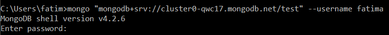

# Mongo DB Cheatsheet
## What is Mongo DB?
"MongoDB is a database management system designed for web applications and internet infrastructure." (MongoDB in Acion, 2011).
Open source NoSQL database, which means that catch-all term for databases that generally are not relational and that do not have a query language.
__IMPORTANT__ Document oriented.
## Glosary
* __Document:__ basic unit of data. Roughly equivalent to a row in a RDBMS.
* __Collection:__ equivalent to a table with a dynamic schema.
* __Databases:__ each of which have its own collections.
## Getting Started
__Access the MongoDB database using shell__
When initialazing in MongoDB, the sorce gives the options to work from the shell, locally, or online in [MongoDB Atlas](https://www.mongodb.com/cloud/atlas). Once the cluster where you will work in is created, connect locally in the shell writing _mongo --_ followed by the access to the database. For this document, I will be using the provided by my professor.

