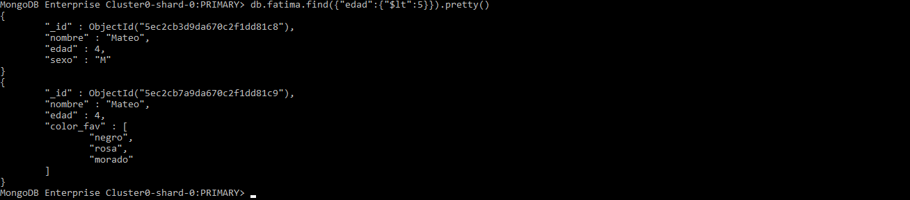
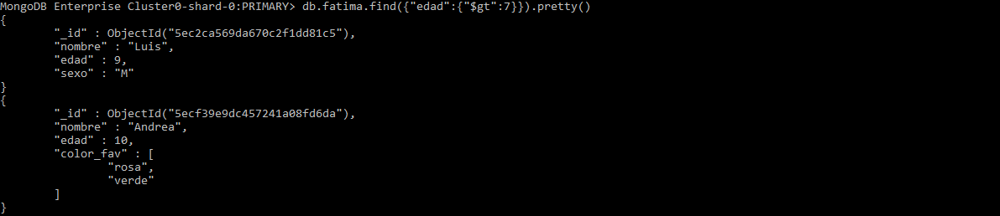
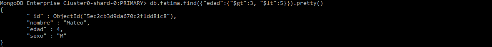
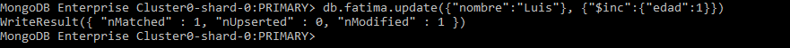
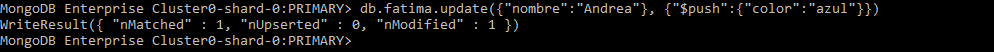
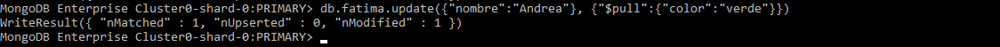

# Mongo DB Cheatsheet
## What is Mongo DB?
"MongoDB is a database management system designed for web applications and internet infrastructure." (MongoDB in Action, 2011).

Open source NoSQL database, which means that catch-all term for databases that generally are not relational and that do not have a query language.

__IMPORTANT__ Mongo DB is document oriented.

## Glosary and important things to point out
* __Document:__ basic unit of data. Roughly equivalent to a row in a RDBMS.
* __Collection:__ equivalent to a table with a dynamic schema.
* __Databases:__ each of which have its own collections.
* __Cluster:__ 
* __Shell:__ MongoDB comes with an JavaScript shell that allows interaction from the command line.
* __Method:__ 
* __Operator:__ Always starts with a $.
* __nRemoved:__ Number of documents deleted.
* __nMatched:__ Number of documents matched.
* __nUpserted:__ Number of documents that were created.
* __nModified:__ Number of documents modified.
* __log:__
* MongoDB takes a values as string if "quoted".
* You can add a date type for a value typing _new Date(year, month, day)_.
* Furthermore, you can store any data type within an array.
* Documents can be embedden within another by adding the document as a value for a given field.
* 

## Install
To install MongoDB to work from the shell, clic the [link](https://www.mongodb.com/download-center/community) to download it and in the [guide](https://docs.mongodb.com/guides/server/install/) to install it. If you want to use MongoDB online, you can use [MongoDB Atlas](https://www.mongodb.com/cloud/atlas).

## 1. Get Started

__Access the MongoDB database using shell__
When initialazing in MongoDB, the sorce gives the options to work from the shell, locally, or online in [MongoDB Atlas](https://www.mongodb.com/cloud/atlas).

Once the cluster where you will work in is created, connect locally in the shell writing ___mongo --___ followed by the access to the database. For this document, I will be using the provided by my professor.


If needed, enter the password.
### > show dbs
To show all the databases. This list shows the name and size of the databases


### > use _dbname_
To switch to an specific database.


### > db
To see the database is currently assigned.


### > db.createCollection("_name_")
Create a new collection in the database.


### > show collections
To show all the collections in the database. You can use _show tables_ instead and the output is the same.


### > help
To show a menu with more commands you may need and would like to give it a check.


## 2. Insert Documents
An unique _ _id_ field is given when a document is inserted using the ObjectId data Type.

The general syntaxis is specifying the collection followed by the method to perfom

### > db._name_.insert({"field1":"value1", "field2":"value2", ...})
Inserting a new document to your collection. If the collection does not exist yet, it will be created automatically.As the parameter, give the JSON object you want to insert ([JSON Syntax](https://www.w3schools.com/js/js_json_syntax.asp)).


If the message
```
WriteResult({ "nInserted": 1 })
```
appears, the documment was successfully inserted.

You can also use
```
> db._name_.insertOne({"field1":"value1", "field2":"value2", ...})
```
or
```
> db._name_.insertMany(\[{"field1":"value1",...},{"field2":"value2",...},...\])
```
to insert more than one document at the same time.

## 3. Find Documents

### > db._name_.find()
To see which documents the collection contains.


### > db._name_.find().pretty()
To format the results of the collection.


### > db._name_.find({"field":"value"}).pretty()
If you look for an specific field in your documents, express the values inside the operation writing the field and value.

.png)

### > db._name_.find({"field.fieldembedded":"value"}).pretty()
To search for a field embedded into anothe document, you can use dot dotation to specify the embedded field you would like to search. The number of dots depends on the number of "levels" you have to pass through to get the desired field.


### > db._name_.find({"field1":"value1", "field2":"value2", ... }).pretty()
You can query based on multiple criteria by passing in comma-separated queries


### > db._name_.find({"field":{"$lt":_number_}})
"$lt" is to find documents where a field has an integer or float data type value _lower than_ the number stated.



### > db._name_.find({"field":{"$gt":_number_}})
Opositely, "$gt" is to query an integer or float data type value _greater than_ the number stated.



### > db._name_.find({"field":{"$gt":_number_, "$lt":_number_}})
You can combine two last operators to specify an interval.




## 4. Delete

### > db._name_.remove({"field":"value"})
This method will delete documentch that match with the query.


If the message
```
WriteResult({ "nRemoved": 1 })
```
appears, the document(s) was/were successfully deleted.

## 5. Update data

### > db._name_.update({"field1":"value1"}, {"$set":{"field2":"newvalue"}})
If you want to update some values in ypur collection, you use the update method which envolves a pair of brackets, that states the query parameter, a second pair of brackets which contains the update parameter with the "$set" operator to update all the matching documents.

If the message
```
WriteResult({ "nMatched": 1, "nUpserted": 0, "nModified": 1  })
```
appears, the document(s) was/were successfully updated.


When the "$set" operator is not stated and the content inside the parenthesis goes of the kind of _{"field1":"value"},{"field2:"newvalue"}_ the data will be imported to the document.

### > db._name_.update({"field1":"value1"}, {"$set":{"field2":"newvalue"}}, {"multi":true})
To update multiple documents, the third parameter "multi" must be of the kind _true_ to modified all matching documents.


### > db._name_.update({"field1":"value1"}, {"$inc":{"field2":_number_}})
To increment a field by a specific value, you must use the "$inc" operator. The number will be the times the field is incremented (or decremented if using negative numbers) to.



If the field does not exists, it gets created with the value.

### > db._name_.update({"field1":"value1"}, {"$inc":{"field2":_number_}}, {"upsert":true})
When the "upsert" option is equal to _true_, the document either is updated or created if the field does not exist. This option creates a document using the values from the query and update parameter.


"nUpserted" field of the WriteResult message must increment to know that the document(s) was/were successfully created. Otherwise, if that field is equal to 0 but both "nMatched" and "nModified" are different of zero, then the document(s) was/were successfully updated.

### > db._name_.update({}, {"$unset":{"field1":""}}, {"multi":true})
__Note__ If the query parameter (first pair of brackets) is empty, that means that all the documents of the collection will be taken. Similarly, if the value of the field to update is not stated, it takes all the values of that field.

This command is to remove specified fields from all documents the query match (thanks to the "multi"":true option) due to the "$unset" operator.


### > db._name_.update({}, {"$rename":{"field":"newfield"}}, {"multi":true})
If what you want is to change field names, you can use the "$rename" operator. Inside its brackets, for the value you have to open a new pair of brackets to specified the field you want to rename, followed by : and the new field name.


## 5.1 Updating arrays

### >db._name_.update({"field":"value"}, {"$set":{"field1.2":"newvalue"}})
If you want to update an array value, you also can use the "$set" operator, but using dot dotation when calling the value. For instance, for...

```
"field":["value1", "value2", "value3"]
```

the values are indexed from 0 to n. Therefore, if you want to update "value3", its index is 2 of the "field" field. Thus the command will be as mentioned before.


### > db._name_.update({"field":"value"}, {"$set":{"field1.$":"newvalue"}}, {"multi":true})
If what you want to update are many values in an array instead, and the value has diferent index in every document, when using dot dotation, intead of state the index you have to put $ after the dot and also use the "multi":true option to make the change to all documents.


__Disclaimer for this command__ If some the array values are repeated, this command will only update the first value that match the query.

### > db._name_.update({"field":"value"}, {"$set":{"value1.fieldembedded":"newvalue"}})
If you want to update an embedded value, use dot dotation to specify the field embedded.

### > db._name_.update({"field":"value"}, {"$pop":{"field1":_element_}})
"$pop" operatior will remove either first or last value of an array. If 1, the last element will be removed. If -1 the first element.


### > db._name_.update({"field":"value"}, {"$push":{"field1":"newvalue"}})
To add a value at the end of an array.



### > db._name_.update({"field":"value"}, {"$addToSet":{"field1":"newvalue"}})
To add a value to the end of an array unless it is already present.


### > db._name_.update({"field":"value"}, {"$pull":{"field1":"newvalue"}})
To remove any instance of a value from an array. I f the value is not unique, all instance will be removed from the array.




## More operators
As you might see from the commands, you can use as much operators as you want.

Operator | Use
-------- | ---
$max | Updates if new value is greater than current or insert if empty
$min | Updates if new value is less than current or inser if empty
$mul | Multiplies current field value by specified value. If empty, it inserts 0


